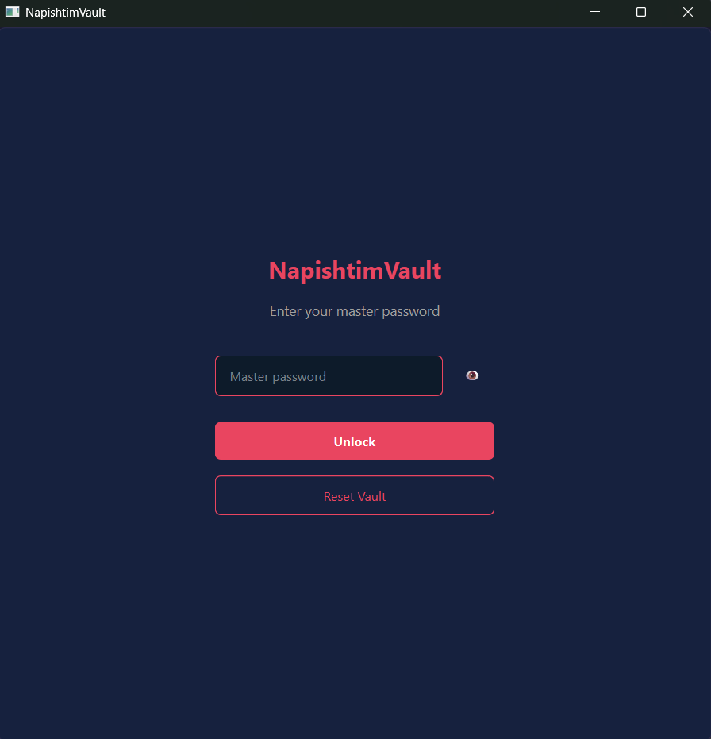

# NapishtimVault

A secure, minimalist password manager built with Python and PyQt6. This project is built because of my own problem of managing many accounts-password information that scattered on my local device in many forms (txt, photos, etc). The aim to centralized personal account-password information while keeping it secure when the device is getting hacked/stolen.

The name "NapishtimVault" is derived from one of my favorite games ever, Ys VI: The Ark of Napishtim, and it's very related with having a key to open the ark.

## Screenshots

<table>
<tr>
<td align="center" width="50%">
<br>
Login Screen
</td>
<td align="center" width="50%">
<br>
Vault Screen
</td>
</tr>
</table>

## Features

- 🔐 Master password authentication with Argon2 hashing
- 🔒 AES-256-GCM encryption for all stored credentials
- 💾 Encrypted-at-rest SQLite storage (SQLCipher)
- ⏱️ Auto-lock after 5 minutes of inactivity or when minimized
- 📋 Clipboard auto-clear after 30 seconds
- 🎨 Dark, minimalist UI

## Setup

### Prerequisites
- Python 3.10 or higher

### Installation

1. Create and activate virtual environment:
```powershell
py -m venv .venv
source ./.venv/Scripts/activate # this is the one works on my local
```

2. Install dependencies:
```powershell
python -m pip install -U pip
python -m pip install -r requirements.txt
```

### Running the Application

```powershell
python -m napishtimvault.app
```

Or directly:
```powershell
python src/napishtimvault/app.py
```

## Building Executable

```powershell
python -m pip install pyinstaller
pyinstaller --clean --noconsole --name NapishtimVault --onefile --paths src run.py
```

The executable will be created in the `dist/` folder.

## Security

- Master password is never stored - only its Argon2 hash
- All credentials are encrypted with AES-256-GCM
- Encryption key is derived from master password using Argon2
- Database is encrypted at rest using SQLCipher
- Secrets are kept in memory for minimum time
- Auto-lock wipes in-memory keys

## License

MIT License
